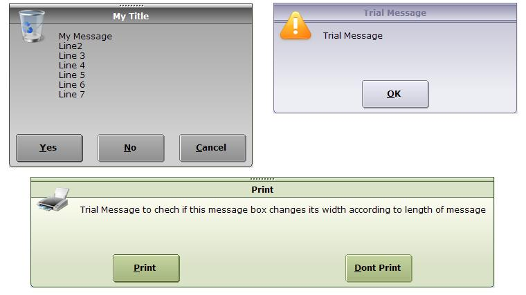



## A Custom Message Box

### Description

This is a custom message box that I developed for my projects. It is having 3 different Styles and 14 different colour schemes to choose from.

Date: 18-APR

User Control Version of the code. Open MsgB Control Project Group.

for further details on how to use, see example in the same code
 
### More Info
 
Syntex is : MsgB(Message,[Style],[Theme],[Buttons], [Icons],[Title])

It returns Index of the button clicked

             |
---                |---
**Submitted On**   |2007-04-17 21:55:42
**By**             |[Divyesh Parikh](https://github.com/Planet-Source-Code/PSCIndex/blob/master/ByAuthor/divyesh-parikh.md)
**Level**          |Intermediate
**User Rating**    |4.6 (32 globes from 7 users)
**Compatibility**  |VB 6\.0
**Category**       |[Custom Controls/ Forms/  Menus](https://github.com/Planet-Source-Code/PSCIndex/blob/master/ByCategory/custom-controls-forms-menus__1-4.md)
**World**          |[Visual Basic](https://github.com/Planet-Source-Code/PSCIndex/blob/master/ByWorld/visual-basic.md)
**Archive File**   |[A\_Custom\_M2060994182007\.zip](https://github.com/Planet-Source-Code/divyesh-parikh-a-custom-message-box__1-68360/archive/master.zip)

